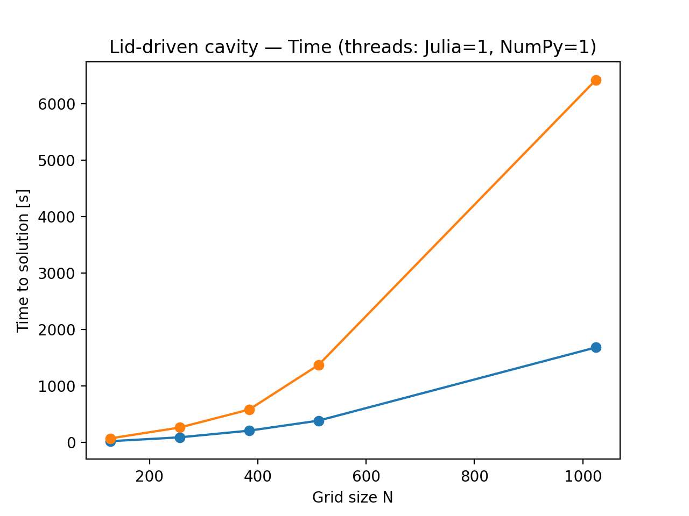
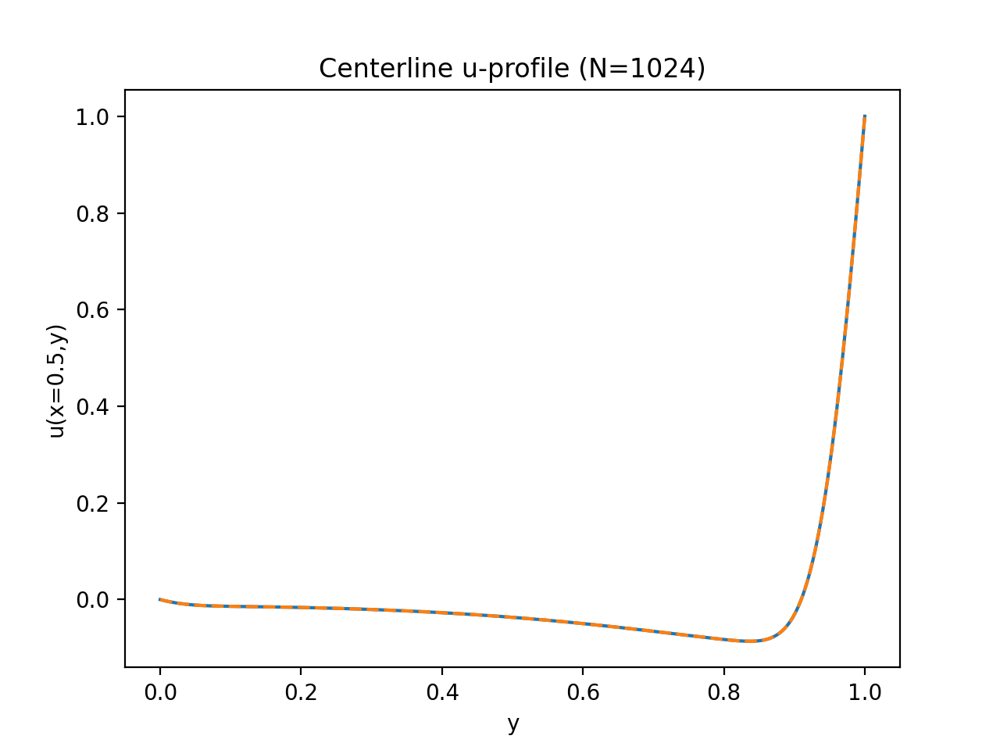
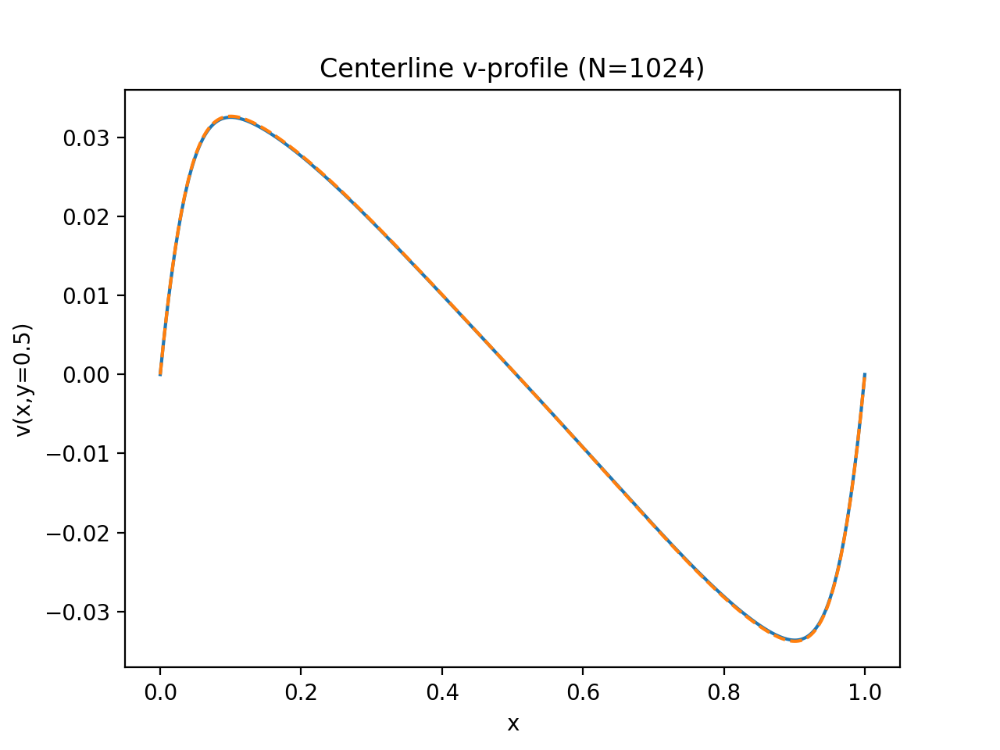

# CFD Mini-Study — Python (NumPy) vs Julia on the 2D Lid-Driven Cavity

---

## Goal

To compare **performance** and **numerical equivalence** between:
- **Python + NumPy** (without Numba), and
- **Julia**

…solving the classical **2D lid-driven cavity** problem in incompressible laminar flow.  
Both implementations were kept **as equivalent as possible** in mathematics, discretization, and boundary conditions.

---

## Physical case

- Domain: unit square [0,1]×[0,1].
- Boundary conditions (no-slip walls, moving lid):
  - Top lid (y=1): u=U_top=1, v=0
  - Other walls: u=0, v=0
- Incompressible, laminar, 2D fluid.
- Reynolds number: Re=100 (tests with N=128, 256, 384).

---

## Governing equations (streamfunction–vorticity)

2D incompressible Navier–Stokes, recast to avoid explicit pressure:

- Streamfunction $ \psi $ ensures continuity:  

  $$
  u = \frac{\partial \psi}{\partial y}, \quad v = -\frac{\partial \psi}{\partial x}
  $$

- Vorticity $ \omega $:  

  $$
  \omega = \frac{\partial v}{\partial x} - \frac{\partial u}{\partial y}
  $$

**System solved:**

1. Vorticity transport–diffusion:  

   $$
   \frac{\partial \omega}{\partial t} 
   + u \frac{\partial \omega}{\partial x} 
   + v \frac{\partial \omega}{\partial y}
   = \nu \left( \frac{\partial^2 \omega}{\partial x^2} + \frac{\partial^2 \omega}{\partial y^2} \right)
   $$

2. Poisson for streamfunction:  

   $$
   \nabla^2 \psi = -\omega
   $$


---

## Numerical discretization

- Uniform Cartesian mesh N×N over [0,1]², dx=dy=1/(N-1).
- **Spatial derivatives**: 2nd-order central differences.
- **Time stepping (ω):**
  - Explicit Euler.
  - **Adaptive timestep by CFL** with safety factor (CFL=0.3–0.4).

- **Poisson ∇²ψ=-ω:**
  - **Jacobi iteration** with fixed iterations per timestep (`jiters=80`).  
  - Simple but fair between languages.

### Boundary Conditions

- ψ = 0 at walls (closed cavity).  
- (u,v) = no-slip; lid with u=1, v=0.  
- ω from Thom’s wall vorticity approximation.

---

## Algorithm (per timestep)

1. Impose ψ boundary conditions.  
2. Compute u,v from ψ.  
3. Impose ω boundary conditions (Thom).  
4. Compute Δt from CFL.  
5. Advance ω (explicit Euler).  
6. Solve Poisson for ψ (Jacobi).  
7. Measure residual res = max|ωⁿ⁺¹ - ωⁿ|.  
8. Stop when res < tol or maxiter reached.

---

## Implementation

- Both codes (Julia and Python) follow the same structure.  
- **Vectorization**:  
  - Julia: broadcasting + views.  
  - Python: NumPy slicing (no Numba).  
- Both use **float64** and identical CFL and Jacobi settings.

---

## Fair comparison measures

1. Identical discretization and math.  
2. Double precision in both codes.  
3. Forced **single-thread mode**:  
   ```bash
   export JULIA_NUM_THREADS=1
   export OMP_NUM_THREADS=1 OPENBLAS_NUM_THREADS=1 MKL_NUM_THREADS=1 VECLIB_MAXIMUM_THREADS=1 NUMEXPR_NUM_THREADS=1
   ```
4. Warm-up compilation not included in timing.  
5. Metrics tracked: runtime, steps, avg_dt, MLUPS, residual.  
6. Validation: centerline u(y), v(x) profiles overlay.

---

## How to run

### Julia (vectorized)
```bash
julia -O3 --check-bounds=no cavity.jl 256 100 0.3 1e-6 80
```

### Python (NumPy vectorized)
```bash
python cavity.py --N 256 --Re 100 --CFL 0.3 --tol 1e-6 --jiters 80
```

### Orchestrator (runs both + plots)
```bash
python run.py --Ns 128 256 384 --Re 100 --CFL 0.3 --tol 1e-6 --jiters 80 --label st
```

Outputs:
- Summaries: `summary_julia.csv`, `summary_python.csv`
- Combined: `results_combined_st.csv`
- Figures: in `figs/`
- Profiles: `u_center_*`, `v_center_*`

---

## Results

### Runtime (s)


**Observation:**  
- Time to solution scales superlinearly with grid size, as expected since the Jacobi solver dominates the cost (\(O(N^2 \times N_{\text{steps}})\)).  
- Julia consistently runs faster than NumPy by a factor of ~3–4×.  
- At \(N=1024\), Julia finishes in ~1700 s, while NumPy takes over 6300 s.

---

### Throughput (MLUPS)


**Observation:**  
- Julia sustains ~12–14 MLUPS across resolutions, showing stable efficiency as the grid grows.  
- NumPy reaches at most ~5 MLUPS at moderate sizes, but drops below 4 MLUPS for \(N=512–1024\).  
- This indicates that Julia maintains higher arithmetic intensity and better cache efficiency compared to Python/NumPy.


---

### Speedup NumPy/Julia


**Observation:**  
- Julia is consistently ~3× faster at small grids, increasing up to ~3.8× at \(N=1024\).  
- The widening gap suggests Julia scales more robustly with problem size under single-threaded execution.


---

### Profiles
Examples (N=1024):
  


**Observation:**  
Velocity profiles from Julia and Python overlap almost perfectly → physical equivalence confirmed.  
The differences in performance do **not** affect numerical results.

---

## Hardware used

Tests were run on a **MacBook Air M4 (2024)** with the following specs:  
- **CPU**: Apple M4 (3 nm, 8-core: 4 performance + 4 efficiency, up to 3.7 GHz)  
- **Memory**: 16 GB unified  
- **OS**: macOS Sequoia  
- Both Julia and NumPy forced to run in **single-thread mode** for fairness.

---

## Observations

- **Julia outperforms NumPy** in this CFD benchmark, with speedups of ~3–4× in single-thread mode.  
- The **performance advantage increases with grid size**, highlighting Julia’s efficiency for larger simulations.  
- Despite performance differences, both codes yield **physically identical results**, validating the fairness of the comparison.  
- The main bottleneck remains the **Jacobi Poisson solver** — a simple but slow method. Using SOR or multigrid would shift the comparison to a more realistic HPC context.  

---

## Limitations & extensions

- Jacobi solver is intentionally simple but inefficient.  
- Only Re=100 tested; turbulence would require higher-order time integration and finer grids.  
- Multi-threaded or GPU versions could further highlight performance differences.  

---

*End*
